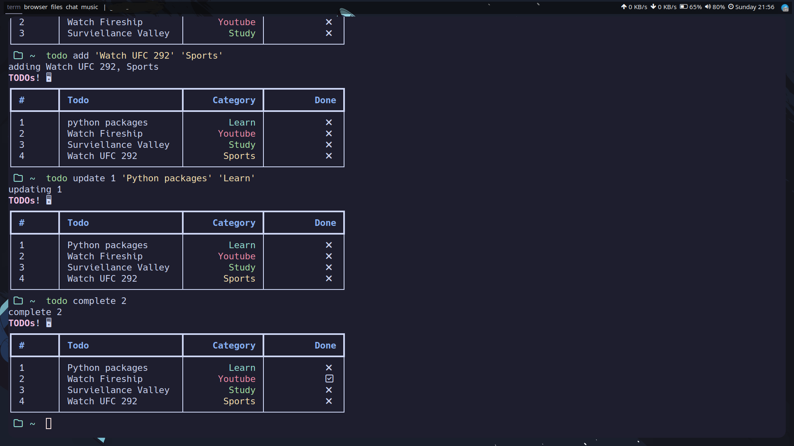

## TODO CLI
This is a cli based TODO list written in python with interactive userface and colors.

#Preview

### Dependencies 
- typer
- rich
- setuptools

### How to install
- Clone this repo.

- Run this command in the directory
`pip install --editable .` and use with `todo` in unix based system and `.\todo` in Windows.

or you can simply run this in the folder itself without installation with `python todo.cli`

## Usage

| Command    | function |
| --------   | ------- |
| --help        | how to use    |
| add *'task' 'category'*        | adds a todo    |
| update *Position* *'task' 'category'*     |updates a todo     |
| complete *Position*     | Checks a todo    |
| delete *Position*     | deletes a todo    |

### Examples
#### Add
`todo add 'clone this repo' 'github'`

#### Update
`todo update 1 'dont clone this repo' 'github'`

#### Complete
`todo complete 1`

#### Delete
`todo delete 1`

